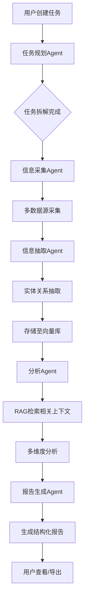
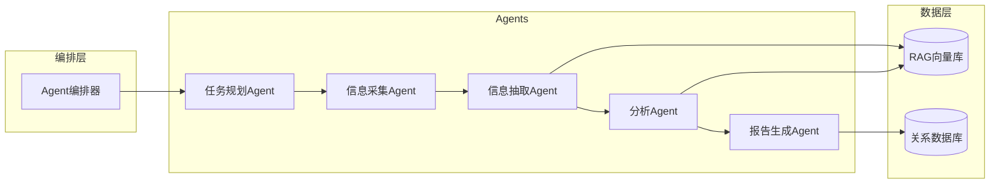

# AI驱动的竞品分析Agent协作系统 - 产品需求文档

## 1. 产品概述

一个基于多Agent协作的智能竞品分析平台，围绕指定产品或公司，自动收集公开信息、整理结构化结论、生成专业的竞品分析报告。系统通过任务规划、信息采集、信息抽取、深度分析和报告生成五个核心Agent的协同工作，实现从原始数据到洞察报告的全自动化流程。

- **核心目标用户**：企业级用户（市场研究部门、产品战略团队、投资分析部门）
- **次要目标用户**：个人用户（独立分析师、创业者、学术研究者）
- **核心价值**：将传统需要数天的竞品调研工作压缩至数小时，提供客观、全面、结构化的分析报告

## 2. 目标用户详细说明

### 2.1 用户分层

#### 企业级用户（核心目标）

企业级用户是本系统的核心服务对象，具有以下特征：

| 特征类别 | 具体描述 |
|---------|---------|
| **使用场景** | 批量、持续性的竞品监控和分析 |
| **协作需求** | 团队多人协作，共享分析结果 |
| **集成需求** | 需要将分析结果集成到内部系统（通过API） |
| **品牌需求** | 需要定制化报告模板和品牌展示 |
| **安全需求** | 对数据安全有较高要求，可能需要私有化部署 |

**企业级用户角色划分：**
- 企业管理员：负责企业账户管理、成员管理、计费管理
- 企业编辑者：创建和管理分析任务，生成报告
- 企业查看者：仅能查看分享的报告和分析结果

#### 个人用户

| 特征类别 | 具体描述 |
|---------|---------|
| **使用场景** | 单一任务分析、个人研究 |
| **协作需求** | 无团队协作需求 |
| **功能限制** | 基础功能，有使用配额限制 |

### 2.2 功能划分

#### 企业级用户功能集（完整功能）

1. **团队协作管理**
   - 成员邀请与角色分配（管理员/编辑/查看者）
   - 权限矩阵配置
   - 邀请链接生成

2. **高级分析能力**
   - 多任务并发执行
   - 优先队列处理
   - 自定义分析维度

3. **企业知识库**
   - 共享数据源配置（全员可见）
   - 企业专属向量库配置
   - 数据源个性化扩展

4. **报告协作**
   - 报告评论与批注
   - 版本管理
   - 分享链接生成

5. **高级导出**
   - PDF/Word自定义模板
   - 品牌标识上传
   - 批量导出

6. **API接入**
   - API Key生成与管理
   - 完整API接口文档
   - Webhook配置

7. **管理员控制台**
   - 企业用量统计
   - 成员活跃度分析
   - 账单管理与套餐升级

#### 个人用户功能集（基础功能）

1. **任务中心**
   - 创建分析任务
   - 查看任务列表
   - 取消任务

2. **分析看板**
   - 实时查看分析进度
   - Agent执行状态监控

3. **报告中心**
   - 查看报告列表
   - Markdown格式导出

4. **个人设置**
   - 修改密码
   - 查看使用配额

## 3. 核心功能模块

### 3.1 页面清单

#### 通用页面（个人用户）
| 页面名称 | 模块名称 | 功能描述 |
|----------|----------|----------|
| 登录/注册页 | 认证表单 | 邮箱登录、社交账号登录、企业邮箱注册 |
| 任务中心页 | 任务创建表单 | 输入目标产品/公司名称、选择分析维度、设置时间范围 |
| 任务中心页 | 任务列表 | 展示所有任务、状态筛选、搜索排序 |
| 任务中心页 | 任务卡片 | 显示任务名称、状态、进度、创建时间、操作按钮 |
| 分析看板页 | Agent执行流程图 | 可视化展示5个Agent的执行状态和依赖关系 |
| 分析看板页 | 实时日志面板 | 滚动展示各Agent的执行日志和中间结果 |
| 分析看板页 | 数据预览区 | 展示采集到的原始数据、抽取的结构化信息 |
| 报告中心页 | 报告列表 | 卡片式展示所有生成的报告 |
| 报告中心页 | 报告详情 | 分章节展示报告内容、支持Markdown渲染 |
| 报告中心页 | 导出功能 | 支持Markdown格式导出 |

#### 企业用户扩展页面

| 页面名称 | 模块名称 | 功能描述 |
|----------|----------|----------|
| 团队管理页 | 成员列表 | 企业成员管理、角色分配、邀请链接生成 |
| 团队管理页 | 权限配置 | 编辑者/查看者权限矩阵配置 |
| 企业知识库页 | 共享数据源 | 企业级数据源配置、全员可见 |
| 企业知识库页 | 报告模板 | 自定义报告模板、上传品牌标识 |
| API管理页 | API配置 | API Key生成、接口文档、Webhook设置 |
| 管理员控制台 | 用量统计 | 企业任务用量、成员活跃度统计 |
| 管理员控制台 | 账单管理 | 套餐升级、用量计费明细 |

### 3.2 页面详情

#### 任务中心页 - 任务创建表单
- **输入字段**：
  - 目标产品/公司名称（必填，支持多目标）
  - 分析维度选择（多选：产品功能、定价策略、市场份额、用户评价、技术架构等）
  - 时间范围（起始日期 - 结束日期）
  - 竞品对比维度（可选）
- **交互方式**：步骤式表单，引导用户完成配置
- **验证规则**：目标名称必填，分析维度至少选择一个

#### 任务中心页 - 任务列表
- **布局**：网格/列表切换
- **卡片信息**：任务名称、目标公司/产品、状态标签、进度条、创建时间、操作按钮
- **状态筛选**：全部/进行中/已完成/已失败
- **搜索**：按任务名称或目标名称搜索

#### 分析看板页 - Agent执行流程图
- **展示形式**：横向流程图，5个Agent节点串联
- **节点状态**：
  - 等待中（灰色）
  - 执行中（蓝色脉冲动画）
  - 完成（绿色勾选）
  - 失败（红色叉号）
- **连接线**：执行中有流动动画
- **实时更新**：通过WebSocket/SSE实时同步状态

#### 分析看板页 - 实时日志面板
- **风格**：深色终端风格，等宽字体
- **日志级别**：INFO（白色）、WARNING（黄色）、ERROR（红色）
- **自动滚动**：新日志自动滚动到底部
- **日志内容**：时间戳、Agent名称、日志消息

#### 报告中心页 - 报告详情
- **布局**：左侧目录导航 + 右侧内容区
- **目录**：自动提取报告章节，支持锚点跳转
- **内容格式**：Markdown渲染，支持代码块高亮、表格、图表
- **操作栏**：导出按钮、分享按钮、收藏按钮

## 4. 核心流程

### 4.1 竞品分析主流程

用户创建分析任务后，系统依次调用五个Agent完成分析：

1. **任务规划Agent**：解析用户需求，拆解分析任务，生成执行计划
2. **信息采集Agent**：根据计划从多数据源采集公开信息
3. **信息抽取Agent**：从非结构化数据中提取关键实体和关系
4. **分析Agent**：进行对比分析、趋势分析、SWOT分析等
5. **报告生成Agent**：整合分析结果，生成结构化报告

### 4.2 流程图

### 4.3 Agent协作架构

## 5. 用户界面设计

### 5.1 设计风格

- **主色调**：深蓝色系（#1E3A5F）+ 科技蓝（#4A90D9）作为强调色
- **辅助色**：琥珀色（#F59E0B）用于状态提示，翠绿色（#10B981）用于成功状态
- **按钮风格**：圆角矩形（8px），微阴影，hover时有轻微上浮效果
- **字体**：思源黑体（中文）+ Inter（英文/数字），标题16-24px，正文14px
- **布局风格**：左侧固定导航栏 + 右侧内容区，卡片式布局
- **图标风格**：线性图标，2px线宽，与主色调一致

### 5.2 页面设计概览

| 页面名称 | 模块名称 | UI元素 |
|----------|----------|--------|
| 任务中心页 | 任务创建表单 | 居中卡片，渐变背景，步骤式表单 |
| 任务中心页 | 任务列表 | 网格布局，卡片带状态色条，hover放大效果 |
| 分析看板页 | Agent流程图 | 横向流程图，节点带状态动画，连接线流动效果 |
| 分析看板页 | 实时日志 | 深色终端风格，语法高亮，自动滚动 |
| 报告中心页 | 报告详情 | 左侧目录导航，右侧内容区，支持锚点跳转 |
| 知识库管理页 | 数据源列表 | 表格式布局，带图标，状态标签 |

### 5.3 响应式设计

- **桌面优先**：主要针对1440px及以上屏幕优化
- **平板适配**：导航栏可折叠，卡片自适应宽度
- **移动端**：底部导航栏，单列卡片布局

### 5.4 动效设计

- **页面切换**：淡入淡出 + 轻微位移
- **卡片加载**：骨架屏 + 渐显
- **Agent执行**：节点脉冲动画，进度条流动效果
- **按钮交互**：hover放大，点击涟漪效果

## 6. Agent详细设计

### 6.1 任务规划Agent

- **输入**：用户任务描述、分析目标
- **输出**：结构化执行计划（JSON格式）
- **能力**：意图理解、任务分解、优先级排序、资源预估

### 6.2 信息采集Agent

- **数据源**：新闻网站、社交媒体、财报数据库、产品官网、应用商店
- **输出**：原始文本、网页快照、结构化数据
- **能力**：多源采集、增量更新、去重过滤

### 6.3 信息抽取Agent

- **抽取目标**：公司信息、产品信息、市场数据、用户评价
- **输出**：结构化实体、关系三元组
- **能力**：命名实体识别、关系抽取、情感分析

### 6.4 分析Agent

- **分析维度**：产品对比、市场定位、用户口碑、发展趋势、SWOT分析
- **输入**：RAG检索结果 + 抽取的结构化数据
- **输出**：分析结论、可视化图表数据

### 6.5 报告生成Agent

- **报告结构**：执行摘要、公司概览、产品分析、市场分析、竞争格局、结论建议
- **输出格式**：Markdown、PDF、Word
- **能力**：章节编排、图表生成、摘要提炼

## 7. 非功能性需求

- **性能**：单任务分析时间 < 30分钟
- **并发**：支持100个并发任务
- **可用性**：系统可用性 > 99.5%
- **安全性**：数据加密存储，API鉴权访问
- **扩展性**：支持新增数据源、自定义Agent
