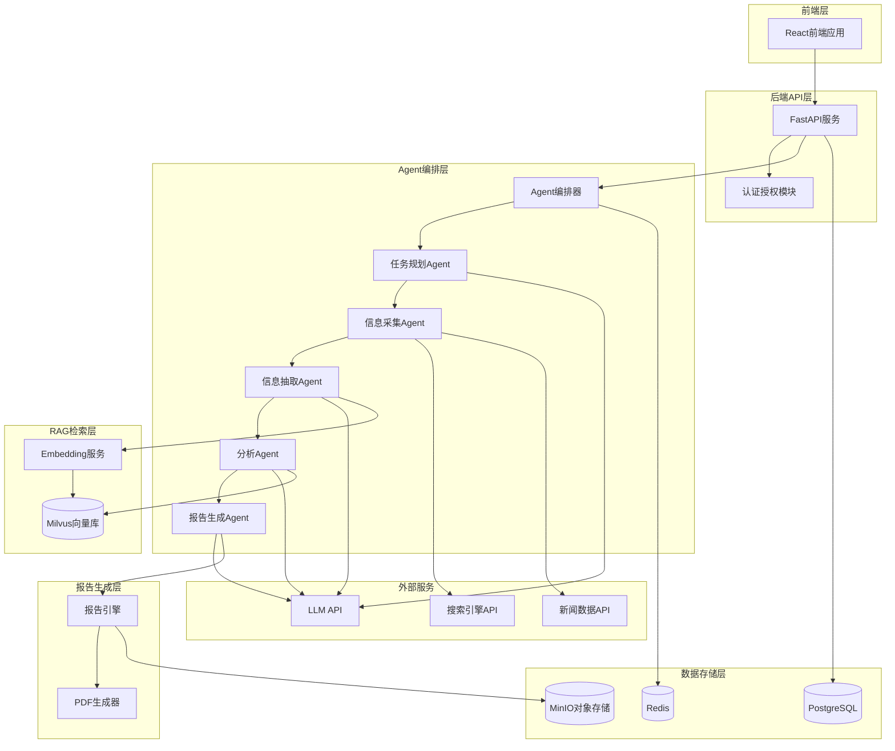
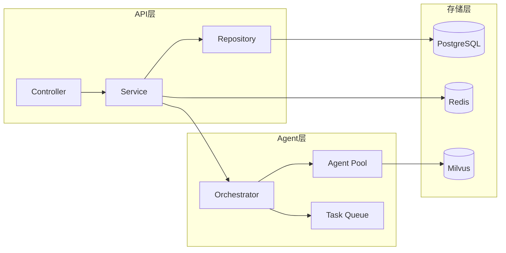
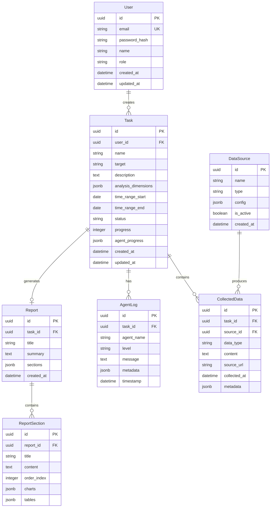
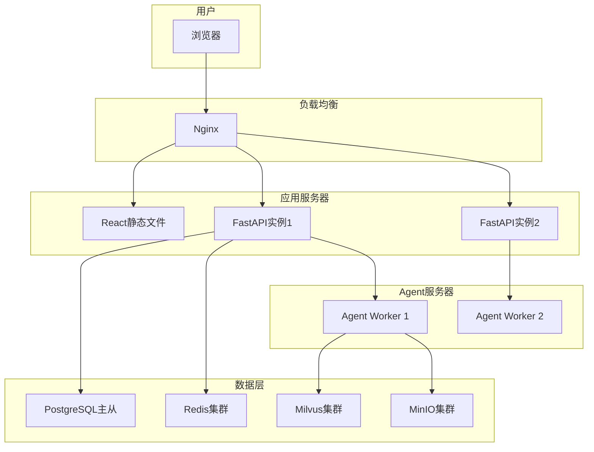

# AI驱动的竞品分析Agent协作系统 - 技术架构文档

## 1. 架构设计



## 2. 技术选型

### 2.1 前端技术栈

- **框架**：React 18 + TypeScript
- **构建工具**：Vite
- **样式方案**：Tailwind CSS 3
- **状态管理**：Zustand
- **路由**：React Router 6
- **UI组件库**：Ant Design 5（按需定制主题）
- **图表库**：ECharts / Recharts
- **Markdown渲染**：react-markdown
- **HTTP客户端**：Axios

### 2.2 后端技术栈

- **框架**：FastAPI (Python 3.11+)
- **认证**：JWT + OAuth2
- **数据库**：PostgreSQL 15
- **缓存**：Redis 7
- **对象存储**：MinIO
- **向量数据库**：Milvus 2.3
- **任务队列**：Celery + Redis
- **ORM**：SQLAlchemy 2.0

### 2.3 Agent技术栈

- **Agent框架**：LangGraph / AutoGen
- **LLM**：OpenAI GPT-4 / Claude / 本地部署模型
- **Embedding**：text-embedding-3-small / BGE
- **爬虫**：Playwright + Scrapy
- **NLP**：spaCy + Transformers

### 2.4 报告生成

- **模板引擎**：Jinja2
- **PDF生成**：WeasyPrint / Playwright
- **Word生成**：python-docx

## 3. 路由定义

### 3.1 前端路由

| 路由 | 页面 | 说明 |
|------|------|------|
| `/` | 重定向到 /tasks | 根路径重定向 |
| `/login` | 登录页 | 用户登录 |
| `/register` | 注册页 | 用户注册 |
| `/tasks` | 任务中心页 | 任务列表和创建 |
| `/tasks/:id` | 任务详情页 | 查看任务配置 |
| `/analysis/:id` | 分析看板页 | 实时查看Agent执行 |
| `/reports` | 报告中心页 | 报告列表 |
| `/reports/:id` | 报告详情页 | 查看和导出报告 |
| `/knowledge` | 知识库管理页 | 数据源和向量库管理 |
| `/settings` | 系统设置页 | Agent参数配置 |

### 3.2 后端API路由

| 路由 | 方法 | 说明 |
|------|------|------|
| `/api/auth/login` | POST | 用户登录 |
| `/api/auth/register` | POST | 用户注册 |
| `/api/tasks` | GET/POST | 任务列表/创建 |
| `/api/tasks/:id` | GET/PUT/DELETE | 任务详情/更新/删除 |
| `/api/tasks/:id/start` | POST | 启动分析任务 |
| `/api/tasks/:id/status` | GET | 获取任务执行状态 |
| `/api/tasks/:id/logs` | GET | 获取执行日志（SSE） |
| `/api/reports` | GET | 报告列表 |
| `/api/reports/:id` | GET | 报告详情 |
| `/api/reports/:id/export` | GET | 导出报告 |
| `/api/datasources` | GET/POST | 数据源管理 |
| `/api/agents/config` | GET/PUT | Agent配置 |
| `/api/knowledge/status` | GET | 知识库状态 |

## 4. API接口定义

### 4.1 任务相关接口

```typescript
interface Task {
  id: string;
  name: string;
  target: string;
  description: string;
  analysis_dimensions: string[];
  time_range: {
    start: string;
    end: string;
  };
  status: 'pending' | 'planning' | 'collecting' | 'extracting' | 'analyzing' | 'generating' | 'completed' | 'failed';
  progress: number;
  created_at: string;
  updated_at: string;
  user_id: string;
}

interface CreateTaskRequest {
  name: string;
  target: string;
  description: string;
  analysis_dimensions: string[];
  time_range_start: string;
  time_range_end: string;
}

interface TaskStatusResponse {
  task_id: string;
  status: Task['status'];
  progress: number;
  current_agent: string;
  agent_progress: {
    planner: number;
    collector: number;
    extractor: number;
    analyzer: number;
    reporter: number;
  };
  message: string;
}
```

### 4.2 报告相关接口

```typescript
interface Report {
  id: string;
  task_id: string;
  title: string;
  summary: string;
  sections: ReportSection[];
  created_at: string;
  export_formats: ('pdf' | 'word' | 'markdown')[];
}

interface ReportSection {
  id: string;
  title: string;
  content: string;
  charts?: ChartData[];
  tables?: TableData[];
}

interface ChartData {
  type: 'bar' | 'line' | 'pie' | 'radar';
  title: string;
  data: any;
}

interface TableData {
  headers: string[];
  rows: string[][];
}
```

### 4.3 Agent日志接口（SSE）

```
GET /api/tasks/:id/logs

事件格式:
event: agent_log
data: {"agent": "collector", "message": "正在采集新闻数据...", "timestamp": "2024-01-15T10:30:00Z"}

event: agent_progress
data: {"agent": "collector", "progress": 45, "total": 100}
```

## 5. 服务架构图



## 6. 数据模型

### 6.1 数据模型定义



### 6.2 数据定义语言（DDL）

```sql
CREATE TABLE users (
    id UUID PRIMARY KEY DEFAULT gen_random_uuid(),
    email VARCHAR(255) UNIQUE NOT NULL,
    password_hash VARCHAR(255) NOT NULL,
    name VARCHAR(100),
    role VARCHAR(20) DEFAULT 'user',
    created_at TIMESTAMP DEFAULT CURRENT_TIMESTAMP,
    updated_at TIMESTAMP DEFAULT CURRENT_TIMESTAMP
);

CREATE TABLE tasks (
    id UUID PRIMARY KEY DEFAULT gen_random_uuid(),
    user_id UUID REFERENCES users(id),
    name VARCHAR(255) NOT NULL,
    target VARCHAR(255) NOT NULL,
    description TEXT,
    analysis_dimensions JSONB DEFAULT '[]',
    time_range_start DATE,
    time_range_end DATE,
    status VARCHAR(20) DEFAULT 'pending',
    progress INTEGER DEFAULT 0,
    agent_progress JSONB DEFAULT '{}',
    created_at TIMESTAMP DEFAULT CURRENT_TIMESTAMP,
    updated_at TIMESTAMP DEFAULT CURRENT_TIMESTAMP
);

CREATE TABLE reports (
    id UUID PRIMARY KEY DEFAULT gen_random_uuid(),
    task_id UUID REFERENCES tasks(id),
    title VARCHAR(255),
    summary TEXT,
    sections JSONB DEFAULT '[]',
    created_at TIMESTAMP DEFAULT CURRENT_TIMESTAMP
);

CREATE TABLE agent_logs (
    id UUID PRIMARY KEY DEFAULT gen_random_uuid(),
    task_id UUID REFERENCES tasks(id),
    agent_name VARCHAR(50),
    level VARCHAR(20),
    message TEXT,
    metadata JSONB,
    timestamp TIMESTAMP DEFAULT CURRENT_TIMESTAMP
);

CREATE TABLE collected_data (
    id UUID PRIMARY KEY DEFAULT gen_random_uuid(),
    task_id UUID REFERENCES tasks(id),
    source_id UUID REFERENCES data_sources(id),
    data_type VARCHAR(50),
    content TEXT,
    source_url VARCHAR(500),
    collected_at TIMESTAMP DEFAULT CURRENT_TIMESTAMP,
    metadata JSONB
);

CREATE TABLE data_sources (
    id UUID PRIMARY KEY DEFAULT gen_random_uuid(),
    name VARCHAR(100),
    type VARCHAR(50),
    config JSONB,
    is_active BOOLEAN DEFAULT true,
    created_at TIMESTAMP DEFAULT CURRENT_TIMESTAMP
);

CREATE INDEX idx_tasks_user_id ON tasks(user_id);
CREATE INDEX idx_tasks_status ON tasks(status);
CREATE INDEX idx_agent_logs_task_id ON agent_logs(task_id);
CREATE INDEX idx_collected_data_task_id ON collected_data(task_id);
```

## 7. Agent详细设计

### 7.1 Agent接口规范

```python
from abc import ABC, abstractmethod
from typing import Dict, Any, List
from pydantic import BaseModel

class AgentInput(BaseModel):
    task_id: str
    config: Dict[str, Any]
    context: Dict[str, Any]

class AgentOutput(BaseModel):
    success: bool
    data: Dict[str, Any]
    logs: List[Dict[str, Any]]
    error: str | None = None

class BaseAgent(ABC):
    def __init__(self, name: str, llm_client, config: Dict[str, Any]):
        self.name = name
        self.llm = llm_client
        self.config = config
    
    @abstractmethod
    async def execute(self, input_data: AgentInput) -> AgentOutput:
        pass
    
    async def log(self, message: str, level: str = "info"):
        pass
```

### 7.2 任务规划Agent

```python
class PlannerAgent(BaseAgent):
    """
    负责解析用户需求，生成结构化执行计划
    """
    async def execute(self, input_data: AgentInput) -> AgentOutput:
        target = input_data.context.get("target")
        dimensions = input_data.context.get("analysis_dimensions", [])
        
        plan = await self._generate_plan(target, dimensions)
        
        return AgentOutput(
            success=True,
            data={"plan": plan},
            logs=[{"message": f"生成执行计划: {len(plan['steps'])}个步骤"}]
        )
    
    async def _generate_plan(self, target: str, dimensions: List[str]) -> Dict:
        prompt = self._build_planning_prompt(target, dimensions)
        response = await self.llm.generate(prompt)
        return self._parse_plan(response)
```

### 7.3 信息采集Agent

```python
class CollectorAgent(BaseAgent):
    """
    负责从多数据源采集信息
    """
    def __init__(self, name: str, llm_client, config: Dict[str, Any]):
        super().__init__(name, llm_client, config)
        self.crawlers = {
            "news": NewsCrawler(),
            "social": SocialMediaCrawler(),
            "financial": FinancialReportCrawler(),
            "product": ProductInfoCrawler()
        }
    
    async def execute(self, input_data: AgentInput) -> AgentOutput:
        plan = input_data.context.get("plan")
        collected_data = []
        
        for source_type in plan.get("sources", []):
            crawler = self.crawlers.get(source_type)
            if crawler:
                data = await crawler.collect(plan["keywords"])
                collected_data.extend(data)
        
        return AgentOutput(
            success=True,
            data={"collected_data": collected_data},
            logs=[{"message": f"采集完成: {len(collected_data)}条数据"}]
        )
```

## 8. 部署架构



## 9. 项目目录结构

```
competitor-analysis-agent/
├── frontend/                    # 前端项目
│   ├── src/
│   │   ├── components/          # 通用组件
│   │   ├── pages/               # 页面组件
│   │   ├── hooks/               # 自定义Hooks
│   │   ├── stores/              # Zustand状态
│   │   ├── services/            # API服务
│   │   ├── utils/               # 工具函数
│   │   └── types/               # TypeScript类型
│   ├── public/
│   ├── package.json
│   └── vite.config.ts
│
├── backend/                     # 后端项目
│   ├── app/
│   │   ├── api/                 # API路由
│   │   ├── models/              # 数据模型
│   │   ├── services/            # 业务逻辑
│   │   ├── agents/              # Agent实现
│   │   ├── core/                # 核心配置
│   │   └── utils/               # 工具函数
│   ├── alembic/                 # 数据库迁移
│   ├── tests/                   # 测试
│   ├── requirements.txt
│   └── main.py
│
├── docker/                      # Docker配置
│   ├── docker-compose.yml
│   ├── Dockerfile.frontend
│   └── Dockerfile.backend
│
└── docs/                        # 文档
    ├── api.md
    └── deployment.md
```
